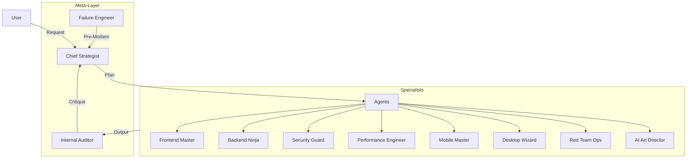

# 👮‍♂️ S.W.A.T. GOD MODE (Semih's Web Agent Team)

> **The Ultimate Army for Code, Mobile, Desktop, Security & AI.**  
> *10 Elite Agents. 0 Limits. Now with 200+ IQ Meta-Orchestration.*

[](https://choosealicense.com/licenses/mit/)

**S.W.A.T.** is a "Deca-Prime" (10 Pillar) Agent System. It doesn't just build sites; it builds ecosystems. It features a military-grade command structure with a Chief Strategist, Internal Auditor, and Failure Engineer.

---

## 🧠 The 200+ IQ Architecture



### Meta-Agents (The Command)
1.  **🧠 Chief Strategist:** The Commander. Routes tasks, plans strategy, and resolves contradictions.
2.  **📝 Internal Auditor:** The Critic. Reviews every output against strict contracts.
3.  **💥 Failure Engineer:** The Pessimist. Conducts pre-mortems to predict how things will break.

### Specialist Agents (The Solider)
1.  **🏗️ App Builder:** The Project Architect.
2.  **🎨 Frontend Master:** The Designer (React 19, Tailwind v4).
3.  **⚙️ Backend Ninja:** The Engineer (Supabase, Postgres).
4.  **📱 Mobile Master:** React Native & Expo.
5.  **💻 Desktop Wizard:** Electron & Tauri.
6.  **🏴‍☠️ Red Team Ops:** Offensive Security & Pentesting.
7.  **✨ AI Art Director:** Flux.1 & LoRA Training.
8.  **🛡️ Security Guard:** Defensive Security (Zod, RLS).
9.  **⚡ Performance Engineer:** Web Vitals & SEO.
10. **🪄 Prompt Enchanter:** Specification Refinement.

---

## 📜 Strict Output Contract

Every agent in this system follows a strict **MANDATORY** output contract. No more random chat.
See [.agent/contracts/output_contract.md](.agent/contracts/output_contract.md) for the JSON schema.

```json
{
  "intent": "Build X",
  "plan": ["Step 1", "Step 2"],
  "risks_and_failure_modes": ["Critical DB lock possible"],
  "confidence_score": 0.95
}
```

---

## 💾 Task Memory System

Every mission execution is recorded forever.
Location: `.task_runs/<YYYY-MM-DD>/<task-slug>/`

- `intent.md`: User request & interpretation.
- `plan.md`: The strategy.
- `decisions.md`: Why we chose X over Y.
- `audit.md`: The Internal Auditor's report.
- `failure_premortem.md`: What could go wrong.

---

## 🧪 Benchmark Suite

We maintain a regression suite of 25+ prompts to ensure agent quality.

**Run Benchmarks:**
```bash
npx tsx scripts/run_benchmarks.ts
```

This simulates agent execution against prompts in `.agent/benchmarks/prompts.json` and saves results to `.task_runs/benchmarks/`.

---

## 🚀 Usage (How to add a new Agent)

1.  Create a folder in `.agent/skills/<agent-name>`.
2.  Create `agent.md` following the template in `app-builder`.
3.  Add the agent to `tool_policy.md` defining allowed/forbidden tools.
4.  Update `chief-strategist/agent.md` to make it aware of the new capability.

---

## 🇹🇷 TÜRKÇE KULLANIM KILAVUZU (GOD MODE 2.0)

**S.W.A.T. (Semih's Web Agent Team)** artık basit bir bot değil, kendi kendine düşünen, planlayan ve denetleyen otonom bir **Yazılım Şirketi Simülasyonudur**.

### 🌟 Yeni Eklenen "Beyin Takımı" (Meta-Agents)

Eskiden sadece kod yazan botlar vardı. Şimdi onları yöneten bir hiyerarşi var:

1.  **🧠 Chief Strategist (Baş Stratejist):**
    *   Sizin "Bana bir E-Ticaret sitesi yap" isteğinizi alır.
    *   Bunu teknik parçalara böler (Önce Veritabanı, Sonra API, Sonra Arayüz).
    *   Hangi ajanın çalışacağına karar verir. Kod yazmaz, **yönetir**.

2.  **📝 Internal Auditor (İç Denetçi):**
    *   Yazılan kodu teslim almadan önce kontrol eder.
    *   "Bu JSON formatına uygun mu?", "Şifreler gizlenmiş mi?" diye bakar.
    *   Hata bulursa ajanı geri gönderir, **kalite kontrol** yapar.

3.  **💥 Failure Engineer (Hata Mühendisi):**
    *   "Her şey yolunda" demez, "Neresi bozulabilir?" diye düşünür.
    *   Sistem çökmeden önce olası sorunları (Pre-Mortem) raporlar.

---

### 🚀 Nasıl Kullanılır?

Artık tek tek ajanlara komut vermek zorunda değilsiniz. Patron sizsiniz, emri verin ve arkanıza yaslanın.

**Örnek Emir:**
> "Bana Next.js ve Supabase kullanan, Stripe ödeme altyapısı olan bir SaaS iskelesi kur. Önce veritabanı şemasını planla, sonra API'ları yaz, en son tasarımı yap."

**Sistem Şöyle Çalışır:**
1.  **Chief Strategist** devreye girer, `.task_runs/` klasöründe bir plan dosyası oluşturur.
2.  **Backend Ninja**'ya görev verir: *"User ve Subscription tablolarını oluştur."*
3.  **Internal Auditor** kontrol eder: *"Tablolarda RLS (Güvenlik) açık mı?"*
4.  **Frontend Master** devreye girer: *"Login sayfasını tasarla."*
5.  **Failure Engineer** uyarır: *"Stripe webhook'ları için imza kontrolü eklediniz mi?"*

---

### 📂 Dosya Yapısı (Hafıza)

Bu sistem unutmuyor. Yapılan her iş kayıt altına alınıyor:

*   `.agent/contracts/`: Ajanların uyması gereken katı kurallar (Anayasa).
*   `.task_runs/`: Projenin hafızası. Her görevin planı ve sonucu buradadır.
*   `.agent/benchmarks/`: Sistemin zekasını test eden 25+ senaryo.

**Test Etmek İçin:**
Sistemin hala 200 IQ ile çalıştığını görmek için şu komutu çalıştırın:
```bash
npx tsx scripts/run_benchmarks.ts
```

---
*Upgraded to GOD MODE 2.0 by Semih Aydın (@smhaydn). 2026*
